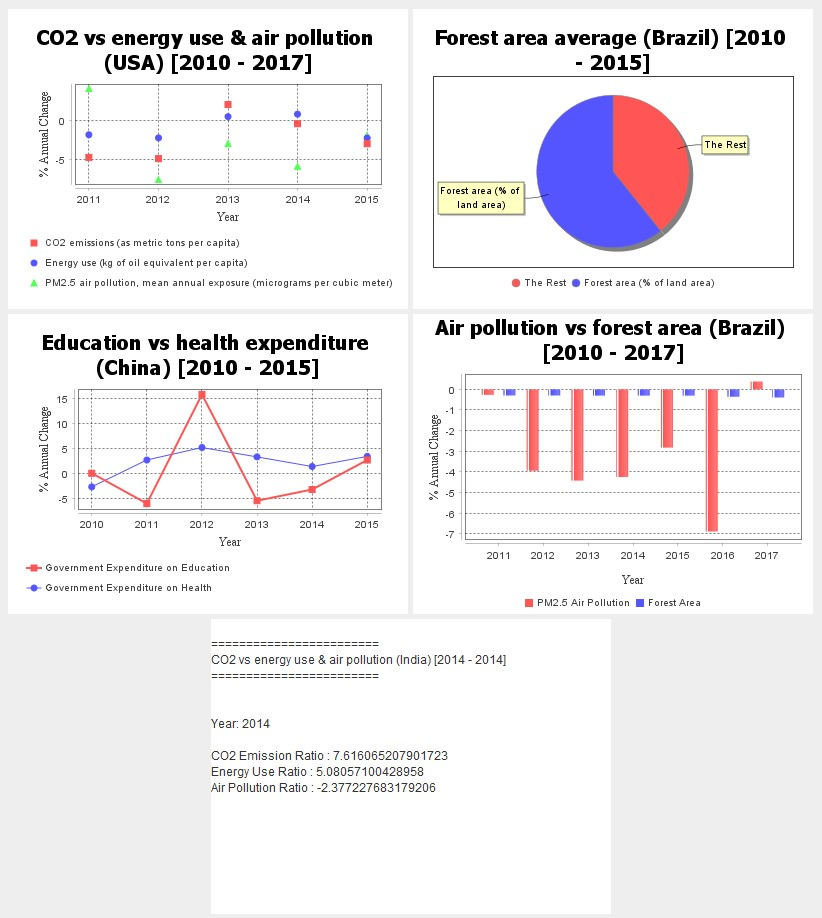

# WB Analysis Tool

Java application to analyze World Bank data.

### Contributors

- [Deepta Adhikary](https://github.com/pdadhikary/)
- [Hakam Singh](https://github.com/Hakam-singh)
- Adil Garad
- Abdullah Ali

## Introduction

This tool uses the
[World Bank API](https://datacatalog.worldbank.org/home)
to load key health and development indicators.
The user can use this data to perform various predefined
analyses. They can also visualize the result of these
analyses via plots and reports using
[JFreeChart](https://www.jfree.org/jfreechart/).

## How to Run the App

With Maven installed on your system, `cd` to the app
directory the app directory and run `mvm clean install`
this will install all the dependencies for the project
and run the test suite.

- `App.java` is the main entry point to the program.

## Project Structure and Design Patterns

The backbone of the project uses a classic MVC composite
pattern.
 
Since the World Bank API presents the data in JSON
format, there is an inherent recursive pattern, we
decided to use the decorator pattern to build the data
fetchers. To simply the user interface of the data fetcher
for clients using the package, we also added a static
Factory method.

## App Tutorial

### Getting Started

At the start the app greets the user with the login module.
Users have the option to register or login with an existing
account.

The requirements for username and passwords is as
follows:

- Username has to be a single word and cannot be empty,
- Password cannot be an empty string.

Upon meeting these requirements, the user is able to register
their account into the database. The following pop-up will be
shown upon successful login.

After pressing the submit button, the user will be redirected
to the main app GUI.

### Creating New Plot Views

From the three drop menu dialogue, located at the top, the
user is able to choose the country and data ranges for which
they wish to analyze data for.

From the bottom two drop down menus determine the type of view
(line chart, bar chart etc.) the data is visualized in and the
analysis method contains predefined data categorized in three
main analysis techniques (annual percent change, ratio or average).

Once happy with their selection, the can press the `+` button
to generate the view.

### Selecting a Plot View

The user can select/deselect a plot simply by left-clicking on the
plot. When a plot is selected a characteristic black border will
surround the plot view. While a plot is selected, any new view
generated will appear to the left of the selected view. Otherwise,
they appear at the very front of list.

### Deleting a Plot View

The user is able to delete any created plot view by first selecting
the view and then clicking the `-` button.

### Recalculating a Plot View

Often times a user may want to change the country or date range of a
view. To do so, start by selecting the view you wish to recalculate
and then make the desired changes to the date range or country drop
down menu. Finally, press the `Recalculate` button to apply these
changes.

### Additional Features

The user can access additional features by right-clicking on the view.
These include, saving the image, zoom in/out, changing plot title or
appearance. These features are provided by the JFreeChart library.

### Available Plot Views

The app support five types of plot view. A scatter plot, pie chart,
line chart, bar chart and a simple text report. Note that some
analyses are only compatible with certain type of views.

